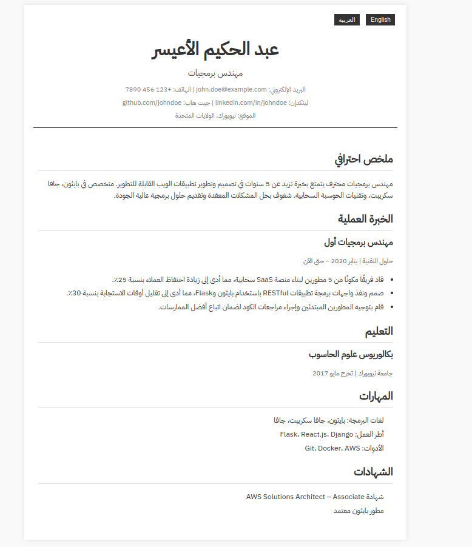
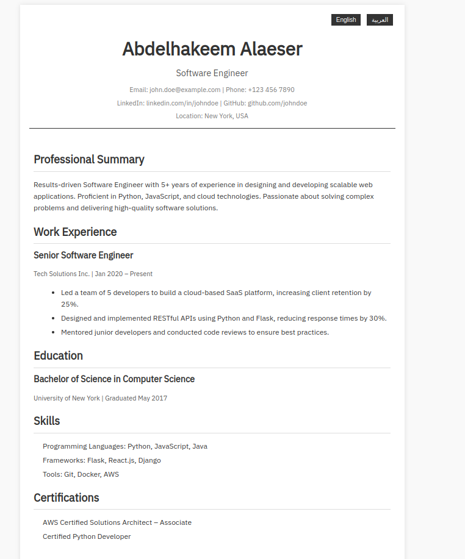

# CV Builder Template

This template provides a minimal setup to resume that support multiple locales (`en`, `ar`).

# Screenshots:

# Installation:
1. clone the repo into your local machine
2. open `cv.html` in your broswer to display the template
3. that's it 🤠️ 
